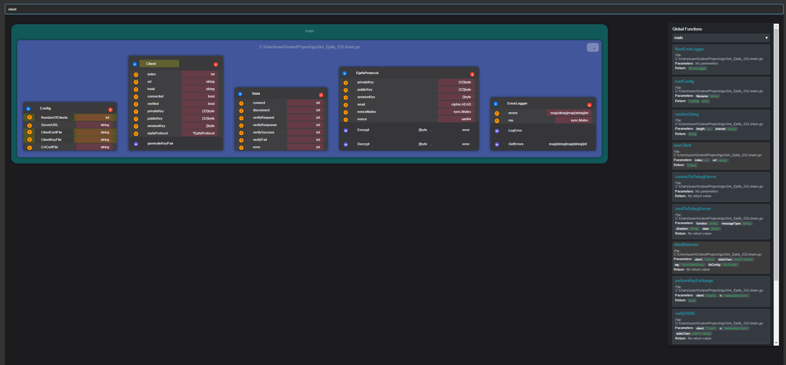

# Go Diagram

Go Diagram - это веб-приложение для визуализации и редактирования структур данных Go-проектов в виде UML-диаграмм. Приложение предоставляет интерактивный интерфейс для работы со структурами Go в реальном времени.

## Основные возможности

- **Визуализация структур**: Отображение структур Go-кода в виде UML-диаграмм с возможностью перетаскивания и масштабирования
- **Редактирование в реальном времени**: 
  - Добавление/удаление структур
  - Изменение имен структур
  - Добавление/удаление полей структур
  - Изменение типов полей
  - Работа с методами структур
- **Организация кода**: Структуры организованы по пакетам и файлам для удобной навигации
- **Поиск**: Встроенный поиск по структурам, полям и методам
- **Связи между структурами**: Визуализация связей между структурами с помощью стрелок
- **Real-time синхронизация**: Автоматическая синхронизация изменений через WebSocket

## Технический стек

- React
- Redux
- WebSocket для real-time коммуникации
- SVG для отрисовки диаграмм

## Архитектура

Приложение построено на основе следующих основных компонентов:

- `UMLDiagram` - основной компонент для отображения диаграммы
- `Struct` - компонент для отображения отдельной структуры
- `Connection` - утилита для WebSocket коммуникации
- Redux store для управления состоянием приложения

## Как использовать

1. Запустите WebSocket сервер на порту 5874
2. Откройте приложение в браузере
3. Используйте интерфейс для:
   - Перетаскивания диаграммы для навигации
   - Добавления новых структур через кнопку "+"
   - Редактирования имен структур и полей
   - Поиска по диаграмме
   - Управления методами структур

## Особенности

- Поддержка hot-reload для разработки
- Автоматическое обновление при изменении исходных файлов
- Масштабируемый интерфейс для работы с большими проектами
- Интуитивная система поиска и навигации

## Назначение

Проект предназначен для разработчиков Go, которым необходимо:
- Визуализировать структуру своего кода
- Планировать архитектуру приложения
- Документировать существующий код
- Обучать других разработчиков структуре проекта
